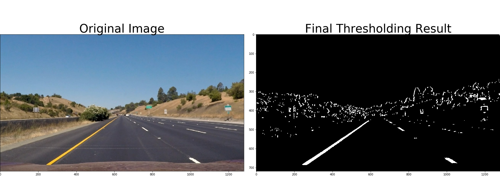

## Writeup Template

### You can use this file as a template for your writeup if you want to submit it as a markdown file, but feel free to use some other method and submit a pdf if you prefer.

---

**Advanced Lane Finding Project**

The goals / steps of this project are the following:

* Compute the camera calibration matrix and distortion coefficients given a set of chessboard images.
* Apply a distortion correction to raw images.
* Use color transforms, gradients, etc., to create a thresholded binary image.
* Apply a perspective transform to rectify binary image ("birds-eye view").
* Detect lane pixels and fit to find the lane boundary.
* Determine the curvature of the lane and vehicle position with respect to center.
* Warp the detected lane boundaries back onto the original image.
* Output visual display of the lane boundaries and numerical estimation of lane curvature and vehicle position.

[//]: # (Image References)

## [Rubric](https://review.udacity.com/#!/rubrics/571/view) Points

### Here I will consider the rubric points individually and describe how I addressed each point in my implementation.  

#### Camera Calibration
I have used the `cv2.findChessboardCorners` function to obtain global `objpoints` and `imgpoints` to pass along to `cv2.calibrateCamera`. First attempt is with `nx = 9` and `ny = 6` then reattempted with `ny = 5` if failed (some images have only 5 corners on the `y` axis. 

I've pickled them for further use in the `camera_calibration.pkl`. Setting the `DO_SAVE = 1` line before the camera calibration will ensure we pickle and do a calibration, setting it otherwise will load the parameters to speed up execution. Example picture:

#### Distortion Correction

Used `glob` to calibrte the camera and to do undistort on the test images, example:

####  Thresholded Binary Image

I have used composed gradient and color space thresholding to create a `combine_all_thresholds` function which `OR`s the thresholds. I have used the lesson 7 code as a starting point and applied the following gradient thresholding:

* `abs_sobel_thresh()` on the `x` and `y` with thresholds `20` to `100` (sobel thresholding on both axes)
* `mag_threshold()` for magnitude thresholding with `30` to `100` thresholds
* `dir_threshold()` for direction of threshold with thresholds `0.7` to `1.3`
* `combine_thresholds()` which combines the above by `AND`ing `x` and `y` gradients, `AND`ing magnitude and direction, and `OR`ing the result

Example:

For the color space I've worked on the HLS space with:

* `hls_sthreshold` with thresholds of `90` to `255` for the saturation channel
* `hls_lthreshold` with thresholds of `220` to `255` for the lightness channel
* `combine_color_thresholds` with `OR`ing the above

This worked a little better for the challenge but messed up the basic video. I've finally taken out the `hls_lthreshold` completely to make it work properly for the obligatory video. This messed up the challenge completely.

Example:

Result of `OR`ing the two (kernels were `15` and `31`:

#### Perspective Adaptation

I've saved the inverse transform when using the `cv2.getPerspectiveTransform` for further used. Then applied a `cv2.warpPerspective` to the picture to distort it. The core of the issue here is getting the `src` and `dst` points right. I've done this by eye-balling it, as can be seen in the code, drawing a rectangle on the undistorted image to select some part of the lane (reasonably into the distance) and then picking a region of about `250`-`1050` for the new lane position. These trnasformations are used to map pixel space o real space later on:

#### Lane pixels identification

I've used the lesson examples to identify the pixels. When there is no prior data, I use the `fit_polynomial` function as demonstrated in lesson 7. I've used `nwindows = 12`, `margin = 80` and `minpix = 45` to fit windows and lines. We start by doing a histogram of the bottom part of the image, selecting the points of maximum frequency and starting to identify the pixels from that point on upward. Finally ,we fit a second degree polynomial to the identified boxe average positions.

When there is at least one such result, we look to the right and to the left of the respective polynomial insid a region of `+/- margin` pixels around them as can be demonstrated in the result picture:

The `search_around_poly()` function then gets previous line fits and outputs future frame line fits. 

`result, new_left_p, new_right_p = search_around_poly(image_to_fit, left_p, right_p)`

#### Curvature and Offset

I've used the methods discussed in the lessons to identify curvature and offset inside the `measure_curvature_real()` and `measure_offset()` functions. Curvature was calculated with the `R_curve` formula and received the polynomial fits as inputs. Results from the final images will show values of curvature of about `8000 m+` for straight lines and `1700 m` for the curve which is described to be around `1 km` meaning it fits the data rather well. I've used the calibration of `3.7 m` per lane, at about `770 px`  per lane (horizontally) and `25 m` per region for `720 px` longitudinally.

The offset is measured as compared to the center of the image and using the fit lines. The bottom line of the image is inserted as `y` int the line fits to get the corresponding `x`s in the `poly` function, which are then averaged. This is the actual center of the lane. The difference between this and the middle of the picture, corrected for mapping `px` to `m` is the offset in meters.

#### Warpback

The final result is the polygon warped back onto the original mage by using the `make_line` function with the fitted polys as input and running through all `y`s generated with `linspace`, then using `cv2.fillPoly`, overlaying ti on the original image with `cv2.addWeighted`, but only after correcting the perspective with `cv2.warpPerspective`.

---

### Pipeline (video)

#### 1. Provide a link to your final video output.  Your pipeline should perform reasonably well on the entire project video (wobbly lines are ok but no catastrophic failures that would cause the car to drive off the road!).

Here's a 

---

### Discussion

#### 1. Briefly discuss any problems / issues you faced in your implementation of this project.  Where will your pipeline likely fail?  What could you do to make it more robust?

Isses are classic and the pipeline fails there: the approach outlined in the lessons isn't robust. Manually selecting various parameters and thresholds will overfit the algorithm. The disastruous results can be seen in the challenge videos. A more robust system would use several variants, together with a NN variant (Spatial CNN: https://towardsdatascience.com/tutorial-build-a-lane-detecto-679fd8953132), which work in tandem, as is the standard in the embedded and rough environment fields (such as aerospace). Such models would yield a confidence value which lets either one take over seamlessly in any situation.

Issues encountered: color filtering (playing with threhsolding), time management (having to do the project on a tight schedule), little visual debugging while running the videos, time required to process the videos (probably did too many copies and data shoveling since it takes 30 minutes to process the first video and my peers need only about 4).

Where the pipeline fails is in situations of: former lane lines covered by concrete or lines that fork from the lane lines and into another direction, margins and direction-bound separators on the freeway, shadows, glints, etc.

I would improve this project by using a sound approach, implementing multiple adaptable techniques (and filters), and using NNs. Mapping would help, deriving curvatures and approximate locations from maps to guide detections.

The problem here is that the processing requirements will demand a Tesla-like solution: custom GPU/NPU ASICs. I don't see why traditional car builders don't invest in this - this is why Tesla is winning, and will win for the foreseeable future. 

There is no "confident full autonomy in 2022" for ANY car on the road using traditional approaches, and it's ridiculous how the likes of Audi/BMW/Volvo can even suggest that. I live in Romania, and at the very least it will take a decade or two for ANY kind of autonomous driving to even be able to engage, let alone take people from one point to a destination. 
